# MealMentor — System Architecture Documentation

## 1. Overall System Architecture

MealMentor uses a three-tier architecture with an optional fourth ML service tier:

```
┌─────────────────────────────────────────────────────────┐
│                    CLIENT BROWSER                        │
│  React 19 + Next.js 16 App Router (Client Components)   │
│  - Web Speech API (voice input)                          │
│  - Quagga2 (barcode camera scanning)                     │
│  - Recharts (data visualization)                          │
└────────────────────────┬────────────────────────────────┘
                         │ HTTPS
┌────────────────────────▼────────────────────────────────┐
│                NEXT.JS APPLICATION SERVER                │
│  - Server Components (SSR/SSG)                           │
│  - API Routes (RESTful backend)                          │
│  - JWT Session Validation (jose)                         │
│  - Rate Limiting (in-memory)                             │
│  - Mongoose ODM                                          │
└────────┬───────────────┬──────────────┬─────────────────┘
         │               │              │
         │ Mongoose  Spawn subprocess  Fetch HTTP
         ▼               ▼              ▼
┌────────────┐  ┌─────────────────┐  ┌──────────────────────┐
│  MongoDB   │  │  Python ML      │  │  External APIs        │
│  Database  │  │  Layer (ml/)    │  │  - Gemini Vision      │
│  (Atlas or │  │  - recommend_   │  │  - Gemini Chat        │
│   Local)   │  │    service.py   │  │  - OpenFoodFacts       │
│            │  │  - rank_food.py │  │  - Google OAuth       │
│            │  │  - XGBoost      │  │  - Google Search API  │
│            │  │    models (.pkl)│  │  - Resend (email)     │
└────────────┘  └────────┬────────┘  └──────────────────────┘
                         │ Optional
                ┌────────▼────────┐
                │  FastAPI        │
                │  Backend        │
                │  (backend/)     │
                │  - Random Forest│
                │    Forecast     │
                │  Port 8000      │
                └─────────────────┘
```

---

## 2. Frontend Architecture

- **Framework**: Next.js 16 with App Router
- **Rendering Strategy**: Mixed — Server Components for data fetching, Client Components for interactivity
- **Routing**: File-system routing with route groups:
  - `(auth)` — unauthenticated pages (login, register, reset-password)
  - `(dashboard)` — authenticated pages with sidebar layout
- **State Management**: React local state + server actions (no external state library)
- **Styling**: Tailwind CSS 4 + CSS custom properties + Shadcn/ui component library
- **Charts**: Recharts library for progress bars, line charts, and area charts
- **Notifications**: Sonner toast library
- **Validation**: Zod schema validation on both client and server

---

## 3. Backend Architecture

- **API Layer**: Next.js API Routes (RESTful, server-side)
- **Authentication**: JWT tokens (HS256) stored in HTTP-only cookies, 7-day expiry
- **Database**: MongoDB with Mongoose ODM, connection pooling via `src/lib/db.ts`
- **Rate Limiting**: In-memory sliding-window bucket algorithm (per-user + IP)
- **Performance Monitoring**: `PerformanceTracker` class adds `Server-Timing` headers
- **ML Integration**: Python subprocess spawn with JSON over stdin/stdout
- **Caching**: 
  - In-memory food catalog cache (`src/lib/data-cache.ts`)
  - Per-day generated meal cache in MongoDB (`GeneratedMeal` collection)
  - Offline barcode cache (`src/data/barcode-cache.ts`)

---

## 4. Database Architecture

- **Database**: MongoDB (flexible document store)
- **ODM**: Mongoose v9 with TypeScript interfaces
- **Connection**: Single connection pool via `src/lib/db.ts` with connection reuse
- **Collections**: 14 collections (see Database Documentation section)
- **Indexes**: Compound indexes for common query patterns (user + date, meal type + price)

---

## 5. AI/ML Architecture

### Recommendation Pipeline
```
User Profile + Today's Intake
         ↓
    BMR/TDEE/Target Calculation  [nutrition.ts]
         ↓
    Nutrient Gap Calculation     [gaps.ts]
         ↓
    Rule-Based Pre-filtering     [recommend.ts / recommend_service.py]
    (hard constraints: allergies, budget, dietary preference, health conditions)
         ↓
    XGBoost Learning-to-Rank     [rank_food.py / ranker/predict.py]
    (or rule-based fallback if model unavailable)
         ↓
    Serving Size Optimization    [recommend.ts → pickServing()]
         ↓
    Result Caching               [GeneratedMeal collection]
         ↓
    Recommendation Response      [API → React UI]
```

### Photo Analysis Pipeline
```
User Uploads Photo
         ↓
    Base64 Encoding (client-side)
         ↓
    POST /api/food-photo
         ↓
    analyzePhotoWithGemini()     [gemini-vision.ts]
    (Primary: gemini-3.8-flash → Fallback: gemini-3.8-flash-lite)
         ↓
    JSON Parsing + Sanitization
         ↓
    FoodPhoto document saved (MongoDB)
         ↓
    User Reviews & Confirms
         ↓
    POST /api/food-photo/log → MealEntry documents created
```

### Weight Forecast Pipeline
```
GET /api/ml/forecast
         ↓
    Try FastAPI: POST http://127.0.0.1:8000/api/v1/predict
    (19 features: profile + 7-day intake averages + targets)
         ↓
    If FastAPI unavailable: spawn Python subprocess
         ↓
    Random Forest model inference
         ↓
    Return 7-day weight change prediction (kg)
```

---

## 6. Authentication Flow

```
User submits login form
         ↓
    POST /api/auth/login
         ↓
    Find user by email (MongoDB)
         ↓
    verifyPassword() [hash.ts] — scrypt comparison
         ↓
    If valid: createSessionToken() [auth.ts] — SignJWT (HS256, 7 days)
         ↓
    Set HTTP-only cookie: mealmentor_session
         ↓
    Return 200 + user object
         ↓
    Subsequent requests: getCurrentUser() [session.ts]
    reads cookie → verifySessionToken() → User.findById()
```

### Google OAuth Flow
```
Click "Sign in with Google"
         ↓
    GET /api/auth/google → Build Google OAuth URL
         ↓
    Browser → Google OAuth consent page
         ↓
    Google → GET /api/auth/google/callback?code=...
         ↓
    Exchange code for Google access token
         ↓
    Fetch Google profile (email, name, googleId)
         ↓
    Upsert User document (create if new, link if existing)
         ↓
    Create JWT session → Set cookie → Redirect to dashboard
```

---

## 7. Mermaid Diagrams

### A. System Architecture Diagram

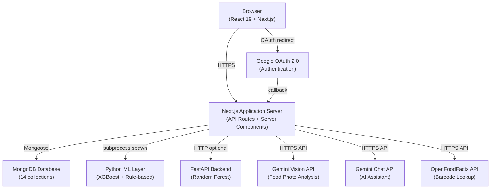

### B. Use Case Diagram

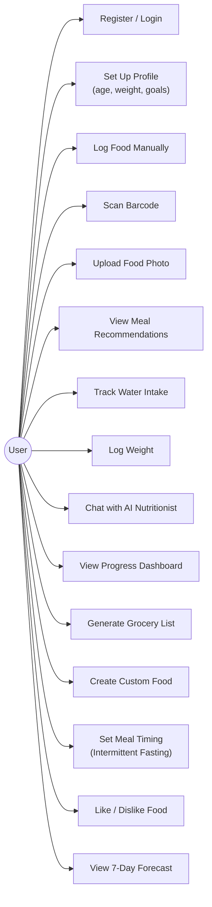

### C. Data Flow Diagram — Level 0

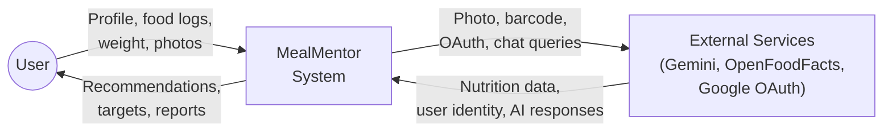

### D. Data Flow Diagram — Level 1

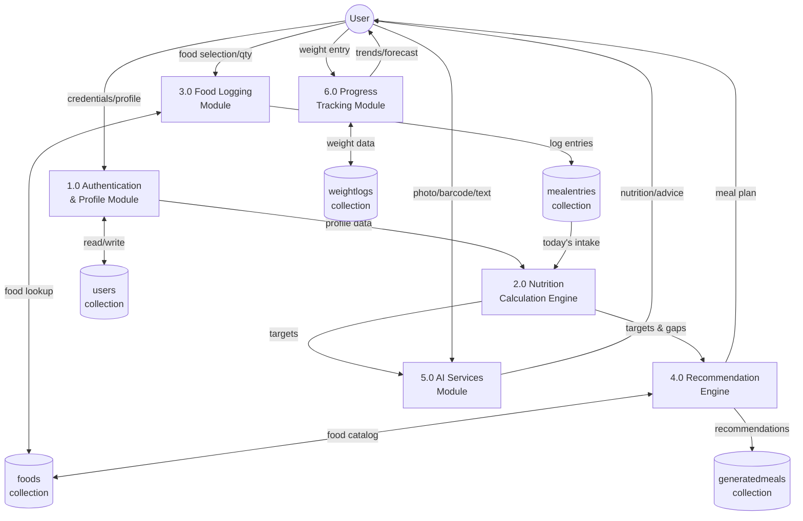

### E. Entity Relationship Diagram

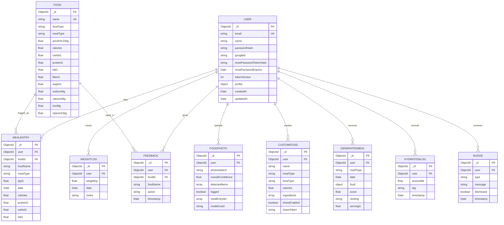

### F. Application Workflow Diagram

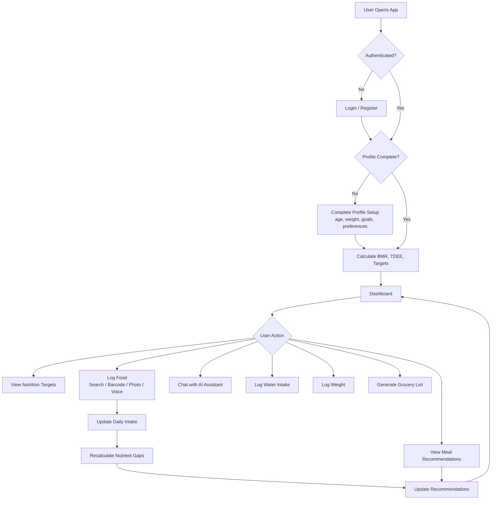

### G. Sequence Diagram — User Authentication

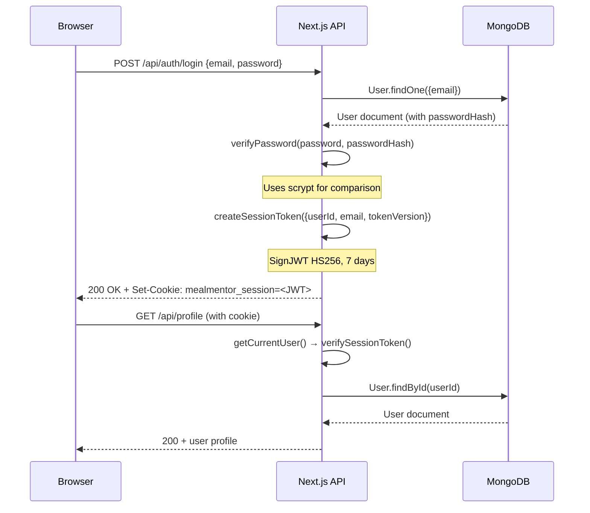

### H. Sequence Diagram — Meal Recommendation Generation

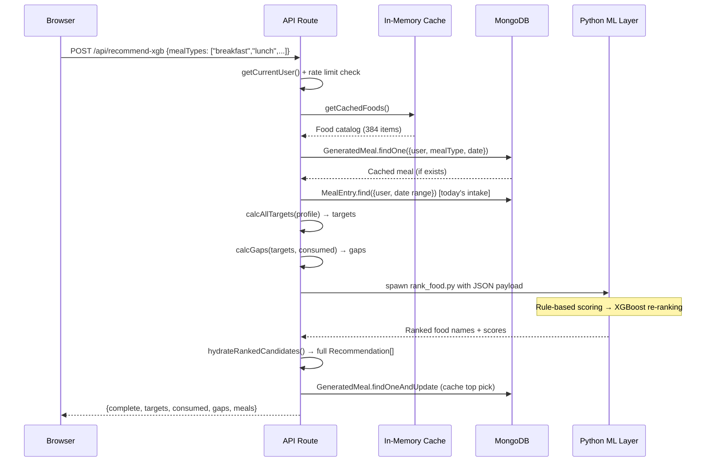

### I. Sequence Diagram — Food Logging

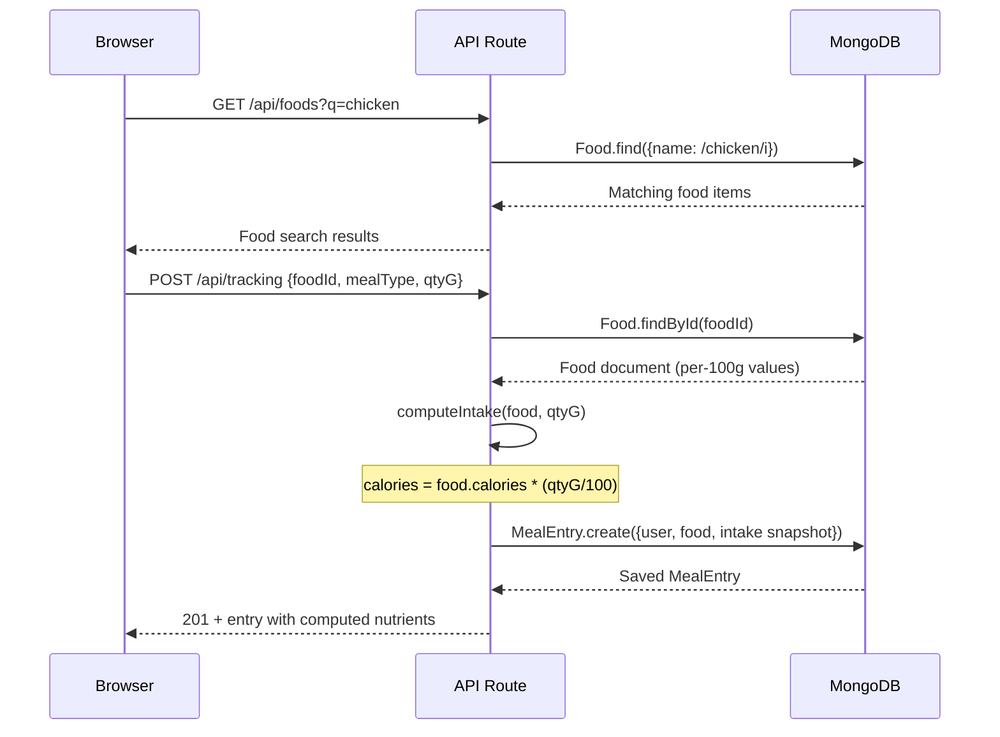

### J. Sequence Diagram — Food Photo Analysis

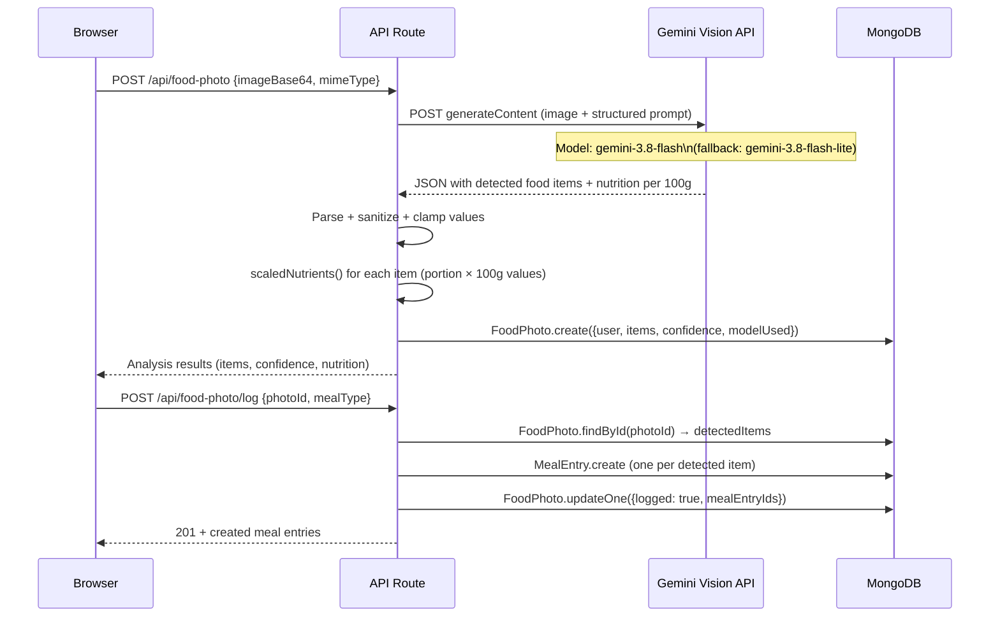

### K. Deployment Architecture Diagram

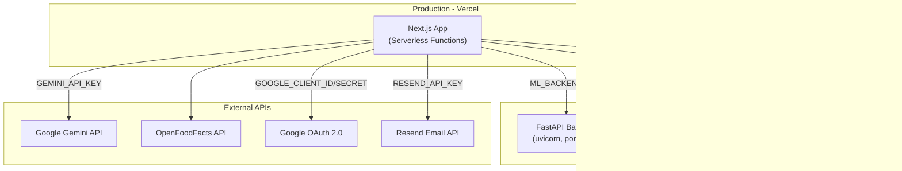
