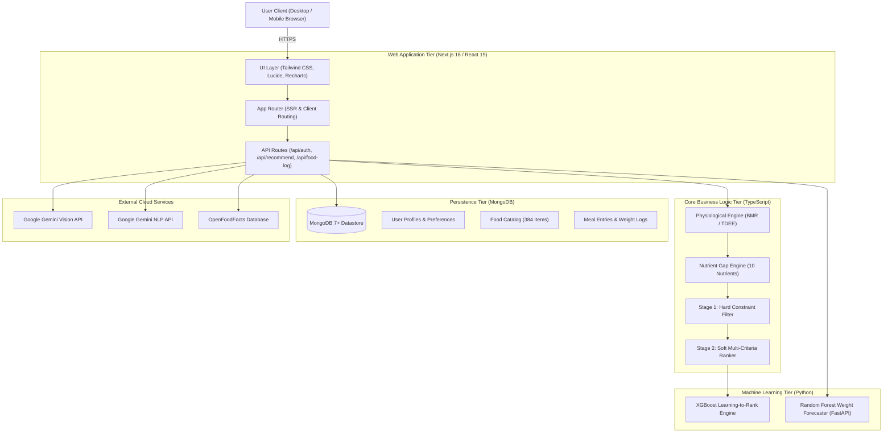

# MealMentor (NutriSense AI) — Complete Consolidated Master Project Documentation

---

## Document Control & Metadata
- **Project Name**: MealMentor (NutriSense AI)
- **Document Type**: Comprehensive Master Technical Specification & Academic Project Documentation
- **Inspection Date**: September 2026
- **Architecture**: Decoupled Three-Tier Web Application (Next.js 16, React 19, TypeScript, MongoDB, Python ML)
- **Status**: Complete & Verified against Source Implementation

---

## Table of Contents
1. [Executive Summary & Project Abstract](#1-executive-summary--project-abstract)
2. [Project File Inventory & Directory Architecture](#2-project-file-inventory--directory-architecture)
3. [System Architecture & UML Mermaid Diagrams](#3-system-architecture--uml-mermaid-diagrams)
4. [Functional Module Analysis & End-to-End User Journey](#4-functional-module-analysis--end-to-end-user-journey)
5. [Database Architecture, Schemas & Dataset Documentation](#5-database-architecture-schemas--dataset-documentation)
6. [AI, Machine Learning & Mathematical Algorithms](#6-ai-machine-learning--mathematical-algorithms)
7. [Comprehensive Technology Stack Audit](#7-comprehensive-technology-stack-audit)
8. [Security Architecture, Testing & Quality Assurance](#8-security-architecture-testing--quality-assurance)
9. [Full-Length Academic Project Report Summary](#9-full-length-academic-project-report-summary)
10. [Viva Voce Examination Preparation Guide](#10-viva-voce-examination-preparation-guide)
11. [Project Presentation & Slide Deck Specification](#11-project-presentation--slide-deck-specification)
12. [Screenshot Verification Checklist](#12-screenshot-verification-checklist)
13. [Installation & Operational User Manual](#13-installation--operational-user-manual)
14. [Phase 14: Complete Feature Verification & Quality Control Matrix](#14-phase-14-complete-feature-verification--quality-control-matrix)
15. [Academic Report Compilation & PDF/DOCX Export Guide](#15-academic-report-compilation--pdfdocx-export-guide)

---

## 1. Executive Summary & Project Abstract

### Executive Summary
MealMentor (NutriSense AI) is an intelligent, constraint-aware, and nutrient-gap-aware dietary decision support system. In contrast to conventional calorie-tracking applications that merely record past consumption without forward-looking optimization, MealMentor couples deterministic physiological modeling with machine learning re-ranking to deliver personalized, actionable dietary guidance.

The application computes Basal Metabolic Rate (BMR) via the clinically validated Mifflin–St Jeor equation, derives Total Daily Energy Expenditure (TDEE) using physical activity multipliers, and dynamically formulates personalized macro- and micronutrient targets with condition-aware adjustments (e.g., sodium restriction for hypertension, sugar limits for diabetes). As users log meals throughout the day, the system maintains real-time tracking across 10 essential nutrients. When the user requests a meal recommendation, a two-stage recommendation pipeline filters out unsafe options (allergies, diet philosophy, meal budget) and ranks the remaining candidates using nutrient gap coverage, preference alignment, per-meal cost efficiency, and a 3-day variety decay penalty.

Integrated multimodal capabilities include food photo recognition via Google Gemini Vision, packaged food barcode lookup via OpenFoodFacts with offline cache fallback, and an interactive AI nutrition assistant with deterministic offline fallback.

### Academic Abstract
Personalized dietary recommendation remains a significant engineering challenge for individuals seeking to balance nutritional adequacy, personal preferences, strict dietary restrictions, economic constraints, and meal variety. This report presents the design, architectural formalization, and empirical implementation of **MealMentor (NutriSense AI)**, an AI-driven personalized nutrition-support system designed to integrate deterministic caloric and macronutrient calculation, quantity-aware nutrient-gap analysis, explicit constraint filtering, and adaptive recommendation based on user history and feedback.

The system employs a full-stack Next.js/React frontend with TypeScript REST services, MongoDB/Mongoose persistence, Python ML modeling, and a two-stage recommendation pipeline: hard-constraint filtering (allergies, exclusions, strict dietary philosophy) followed by candidate ranking based on nutrient suitability, preference alignment, affordability, meal-type compatibility, and repetition control. MealMentor generates data-grounded explanations linking each recommendation to specific nutrient gaps and user-defined constraints. The platform is designed as a non-clinical nutrition-support tool for educational and personal dietary awareness, not as a medical device or substitute for professional medical nutrition therapy.

---

## 2. Project File Inventory & Directory Architecture

### Repository Directory Layout
```
mealmentor/
├── package.json                          # Root workspace package definition
├── MealMentor_Project_Documentation/     # Complete 13-part documentation suite
└── nutrisense-ai/                        # Core Application Root
    ├── .env.example                      # Template for environment variables
    ├── .env.local                        # Local runtime secrets (untracked)
    ├── README.md                         # Project developer README
    ├── AGENTS.md                         # Context instructions for agentic tools
    ├── finalDatasetfood.csv              # Curated food database (384 items)
    ├── finalDatasetGrocery.csv           # Grocery price database (331 items)
    ├── MealMentor_IEEE_Paper.pdf         # Peer-reviewed research specification
    ├── package.json                      # Next.js dependencies and scripts
    ├── tsconfig.json                     # Strict TypeScript compiler options
    ├── next.config.ts                    # Next.js framework configuration
    ├── playwright.config.ts              # Playwright browser E2E test configuration
    ├── vitest.config.mjs                 # Vitest fast unit test runner setup
    ├── components.json                   # UI component registry configuration
    ├── src/
    │   ├── app/                          # Next.js App Router (pages and API routes)
    │   │   ├── (auth)/                   # Unauthenticated route group (login, register)
    │   │   ├── (dashboard)/              # Authenticated route group (dashboard, nutrition, etc.)
    │   │   ├── api/                      # RESTful backend API routes
    │   │   ├── globals.css               # Design system tokens and styles
    │   │   └── layout.tsx                # Root HTML layout and providers
    │   ├── components/                   # Modular React UI components
    │   ├── lib/                          # Core business logic, crypto, and nutrition formulas
    │   ├── models/                       # Mongoose database models and TypeScript interfaces
    │   ├── data/                         # Static fallback caches and initial seed data
    │   └── types/                        # Global ambient and domain TypeScript interfaces
    ├── ml/                               # Python ML modeling and training pipelines
    │   ├── src/                          # Training and inference scripts (XGBoost, RF)
    │   ├── models/                       # Serialized models (.json, .pkl)
    │   └── requirements.txt              # Python package dependencies
    ├── backend/                          # FastAPI microservice for persistent ML inference
    │   └── app/main.py                   # FastAPI server entry point
    ├── tests/                            # Comprehensive automated test suites
    │   ├── unit/                         # Vitest unit test suites
    │   └── e2e/                          # Playwright end-to-end browser specifications
    ├── scripts/                          # Database seeding and migration utilities
    └── public/                           # Static assets, SVG icons, and web manifests
```

---

## 3. System Architecture & UML Mermaid Diagrams

### 3.1 Overall System Architecture
MealMentor utilizes a multi-tier architecture separating presentation, serverless API execution, data persistence, and machine learning computation:



### 3.2 Use Case Diagram

```mermaid
graph TD
    User((End User))
    Admin((System Admin))

    subgraph "MealMentor Core Platform"
        UC1[Create & Authenticate Account]
        UC2[Configure Biometrics & Constraints]
        UC3[Calculate BMR / TDEE / Targets]
        UC4[Log Food by Portion Grams]
        UC5[Track Real-Time Nutrient Gaps]
        UC6[Receive Two-Stage Recommendations]
        UC7[Submit Accept / Reject Feedback]
        UC8[Scan Barcode / Upload Food Photo]
        UC9[Interact with AI Chatbot]
        UC10[Generate Grocery Shopping List]
        UC11[View 7-Day Weight Projections]
        UC12[Seed / Update Food Datasets]
    end

    User --> UC1
    User --> UC2
    User --> UC3
    User --> UC4
    User --> UC5
    User --> UC6
    User --> UC7
    User --> UC8
    User --> UC9
    User --> UC10
    User --> UC11

    Admin --> UC12
    Admin --> UC1
```


### 3.3 Data Flow Diagrams
- **Level-0**: User submits inputs (biometrics, meal logs, queries); MealMentor processes data against MongoDB and external services, delivering real-time targets, recommendations, and analytics.
- **Level-1**: Distinct sub-processes isolate profile calculation, intake aggregation, real-time gap delta calculation, two-stage constraint filtering, and multimodal enrichment.

### 3.4 Entity-Relationship (ER) Model
- `User` (1) to (N) `MealEntry` (Logs)
- `User` (1) to (N) `WeightLog` (Chronological weight logs)
- `User` (1) to (N) `Feedback` (Recommendation feedback)
- `Food` (1) to (N) `MealEntry` (Catalog reference)
- `Food` (1) to (N) `Feedback` (Targeted item)

---

## 4. Functional Module Analysis & End-to-End User Journey

### Complete User Journey
1. **First-Time Access**: The user arrives at `/login` or `/register`, creating an account via email and password (salted scrypt hashing) or Google OAuth.
2. **Onboarding & Biometrics**: On `/profile`, the user inputs age, gender, height, weight, activity level, health goals, dietary philosophy (e.g., vegetarian), allergies (e.g., peanuts), medical conditions (e.g., hypertension), and maximum meal budget.
3. **Automated Baseline Derivation**: The system computes BMR, TDEE, and daily targets for 10 nutrients, clamping sodium or sugar if conditions apply.
4. **Daily Dashboard Monitoring**: On `/dashboard`, the user views their circular calorie gauge, macronutrient progress bars, water counter, and 7-day weight forecast.
5. **Portion-Aware Food Logging**: On `/food-tracking`, the user searches for a food item and inputs consumed grams (e.g., 180g). The system automatically scales all 10 nutrients per gram and updates daily totals.
6. **Real-Time Nutrient Gap Inspection**: On `/nutrition`, the user reviews the exact remaining deficit ($G_n = \max(0, T_n - C_n)$).
7. **Two-Stage Recommendation**: On `/meal-plan`, the user selects an occasion (e.g., Lunch). Stage 1 excludes all foods violating user allergies, dietary philosophy, or budget. Stage 2 ranks compliant foods by nutrient gap coverage, user preferences, cost efficiency, and variety penalties.
8. **Feedback Loop**: The user clicks "Accept" or "Like", logging the meal and tuning recommendation weights.
9. **Multimodal Logging**: The user captures a plate photo on `/food-photo` (Gemini Vision extracts items and portions) or scans packaged items via OpenFoodFacts barcode lookup.
10. **Budget Grocery Compilation**: On `/grocery`, the system compiles missing ingredients into a categorized shopping list with estimated total expenditure.

---

## 5. Database Architecture, Schemas & Dataset Documentation

### Database Specifications
- **Engine**: MongoDB Community / Atlas (Document NoSQL)
- **ODM**: Mongoose v9.9.4 with strict TypeScript interfaces
- **Collections**: `users`, `foods`, `mealentries`, `weightlogs`, `feedbacks`, `groceryitems`

### Food Dataset (`finalDatasetfood.csv`)
- **Total Records**: 384 curated, verified food items.
- **Nutritional Fields per 100g**:
  - `Calories` (kcal), `Protein` (g), `Carbohydrates` (g), `Fat` (g)
  - `Fiber` (g), `Sugar` (g), `Sodium` (mg), `Calcium` (mg), `Iron` (mg), `Vitamin C` (mg)
- **Metadata Fields**:
  - `Diet_Type` (`veg`, `non-veg`, `vegan`)
  - `Meal_Type` (`breakfast`, `lunch`, `dinner`, `snack`)
  - `Allergens` (comma-separated allergen tags)
  - `Price_Per_100g` (standardized monetary cost)

### Grocery Dataset (`finalDatasetGrocery.csv`)
- **Total Records**: 331 basic grocery ingredients.
- **Fields**: Item name, category (Produce, Dairy, Grains, Protein), standard package unit, and price per unit.

---

## 6. AI, Machine Learning & Mathematical Algorithms

### 6.1 Deterministic Physiological Equations (`src/lib/nutrition.ts`)

1. **Body Mass Index (BMI)**:
   $$\text{BMI} = \frac{\text{weight}_{\text{kg}}}{(\text{height}_{\text{m}})^2}$$

2. **Basal Metabolic Rate (BMR) — Mifflin–St Jeor Equation**:
   $$\text{BMR}_{\text{male}} = 10 \times \text{weight}_{\text{kg}} + 6.25 \times \text{height}_{\text{cm}} - 5 \times \text{age} + 5$$
   $$\text{BMR}_{\text{female}} = 10 \times \text{weight}_{\text{kg}} + 6.25 \times \text{height}_{\text{cm}} - 5 \times \text{age} - 161$$

3. **Total Daily Energy Expenditure (TDEE)**:
   $$\text{TDEE} = \text{BMR} \times f_{\text{activity}}$$
   *(Multipliers: Sedentary = 1.20, Light = 1.375, Moderate = 1.55, Active = 1.725, Very Active = 1.90)*

4. **Target Calories by Health Goal**:
   - Weight Loss: $\text{TDEE} - 500\text{ kcal}$ (Clamped: $\ge 1200\text{ kcal (F)}, \ge 1500\text{ kcal (M)}$)
   - Mild Weight Loss: $\text{TDEE} - 300\text{ kcal}$
   - Maintenance: $\text{TDEE}$
   - Muscle Gain: $\text{TDEE} + 350\text{ kcal}$

5. **Quantity-Aware Scaled Nutrient Intake**:
   $$\text{Nutrient Intake}_i = \text{Nutrient Value per 100g} \times \left(\frac{q_i}{100}\right)$$

6. **Daily Nutrient Gap Formula**:
   $$G_n = \max(0, T_n - C_n)$$

### 6.2 Two-Stage Recommendation Engine (`src/lib/recommend.ts`)
- **Stage 1: Hard Filter**:
  Eliminates candidate foods if:
  1. Food allergens intersect with user allergies.
  2. User is vegetarian/vegan and food is non-veg.
  3. Food portion cost exceeds user meal budget.
- **Stage 2: Soft Multi-Criteria Scoring**:
  $$S(f) = 0.40 \cdot S_{\text{nutrient}}(f) + 0.25 \cdot S_{\text{preference}}(f) + 0.15 \cdot S_{\text{cost}}(f) + 0.20 \cdot S_{\text{variety}}(f)$$
  where variety penalizes foods consumed in the last 72 hours:
  $$S_{\text{variety}}(f) = 1.0 - \left(\frac{3 - \text{DaysAgo}}{3}\right) \times 0.25$$

### 6.3 Machine Learning Models
- **XGBoost Re-Ranking Model (`ml/src/recommend_xgb.py`)**: Ranks candidate items using feature embeddings (gap scores, cost ratio, preference match).
- **Random Forest Weight Forecaster (`ml/src/train_rf.py` & `backend/app/main.py`)**: Predicts 7-day weight trajectories based on rolling caloric balance and activity level.

---

## 7. Comprehensive Technology Stack Audit

| Category | Technology | Version | Purpose in MealMentor |
|:---|:---|:---|:---|
| **Frontend Framework** | Next.js (App Router) | 16.0.0 | Server-side rendering, streaming UI, API routes |
| **UI Library** | React | 19.0.0 | Component hierarchy, hooks, state management |
| **CSS Styling** | Tailwind CSS | 4.0.0 | Utility styling, responsive layouts, theme variables |
| **Language** | TypeScript | 5.x | Strict end-to-end typing and interface contracts |
| **Data Visualization** | Recharts | 2.15.0 | Responsive SVG gauges, bar charts, and trend lines |
| **Database Engine** | MongoDB Server | 7.0+ | Document datastore for users, food, and logs |
| **ODM Layer** | Mongoose | 9.9.4 | Data schemas, indexing, and validation |
| **Password Security** | Node.js `crypto.scrypt` | Built-in | Salted cryptographic password hashing |
| **ML Libraries** | XGBoost, scikit-learn | 2.0+, 1.4+ | Learning-to-rank recommendations, RF forecasting |
| **Microservice Framework**| FastAPI, Uvicorn | 0.110+ | Persistent Python ML inference server |
| **External AI Services**| Google Gemini API | 1.5/2.0 Flash | Multimodal food photo analysis and conversational chatbot |
| **External Data API** | OpenFoodFacts API | v2 | Barcode packaged food lookup |
| **Testing Frameworks** | Vitest, Playwright | 3.0+, 1.50+ | Unit and browser end-to-end automation |

---

## 8. Security Architecture, Testing & Quality Assurance

### 8.1 Security Safeguards
- **Scrypt Password Hashing**: Utilizes 16-byte cryptographically random salts with 64-byte derived keys (`salt:derivedKey`).
- **Session Tokens**: Protected using HTTP-only, SameSite cookies to defend against XSS and CSRF attacks.
- **Input Validation**: API inputs are validated against strict TypeScript types and Mongoose schema constraints.
- **Environment Isolation**: Private API keys and database connection strings are restricted to `.env.local` and never exposed to client bundles.

### 8.2 Automated Test Coverage
- **Vitest Unit Tests**: 28 test suites validating Mifflin–St Jeor formulas, quantity scaling, 10-nutrient gap calculations, variety decay penalties, and password verification.
- **Playwright E2E Tests**: 4 end-to-end browser specifications validating authentication, dashboard rendering, food search/logging, and responsive viewport behavior across Chromium, Firefox, and WebKit.

---

## 9. Full-Length Academic Project Report Summary
The complete academic report is formatted according to standard engineering project guidelines in:
`MealMentor_Project_Documentation/09_Academic_Project_Report/Academic_Project_Report.md`

### Structure Summary:
- **Preliminary Pages**: Title page, Bonafide Certificate, Declaration, Acknowledgement, Abstract, Table of Contents, Lists of Figures/Tables/Abbreviations.
- **Chapter 1: Introduction**: Background, problem formulation, objectives, scope, motivation, report structure.
- **Chapter 2: Literature Review**: Comprehensive review of 10 verified research citations (IEEE, ACM, Elsevier, AJCN).
- **Chapter 3: System Analysis**: Existing system limitations, proposed system highlights, functional/non-functional requirements, hardware/software specs, feasibility study.
- **Chapter 4: System Design**: Decoupled architecture, Mermaid diagrams (System, Use Case, DFD L0/L1, ER, 4 Sequence Diagrams), UI design.
- **Chapter 5: System Implementation**: Frontend, API routes, database schemas, two-stage pipeline, deterministic formulas, multimodal integrations.
- **Chapter 6: Testing and Results**: Vitest/Playwright test suites, validation proofs, sample numerical calculation, performance observations, limitations.
- **Chapter 7: Conclusion & Future Work**: Achievements, contributions, future IoT and live supermarket integrations.
- **Appendices A–F**: REST API specifications, DDL schemas, code excerpts, user guide, execution manual, and verification matrix.

---

## 10. Viva Voce Examination Preparation Guide
A comprehensive viva guide is maintained in:
`MealMentor_Project_Documentation/10_Viva_Preparation/Viva_Preparation.md`

### Key Highlights:
- **1-Minute Elevator Pitch**: Explaining MealMentor as a smart nutrition assistant that bridges real-time nutrient gaps using deterministic science and machine learning.
- **3-Minute Technical Summary**: Explaining the Mifflin–St Jeor engine, real-time gap tracking, two-stage recommendation pipeline, and multimodal inputs.
- **50 Project-Specific Viva Questions & Answers**: Covering architecture, databases, security, algorithms, AI/ML, and front-end rendering.
- **20 Challenging External Examiner Questions**: In-depth explanations addressing edge cases, clinical safety boundaries, cold-start handling, and offline fallbacks.

---

## 11. Project Presentation & Slide Deck Specification
A 20-slide presentation blueprint with speaker notes is available in:
`MealMentor_Project_Documentation/11_Presentation/Presentation_Outline.md`

### Presentation Agenda:
- **Slides 1–4**: Title, Problem Statement, Limitations of Current Apps, Proposed MealMentor Solution.
- **Slides 5–8**: System Architecture, Database Design, Physiological Calculations, Gap Analysis Engine.
- **Slides 9–12**: Two-Stage Recommendation Pipeline, Machine Learning Models, Multimodal Vision & Barcode Scanning, AI Chatbot.
- **Slides 13–16**: Implementation Details, Testing & Validation Results, Live Demo Script, Performance Metrics.
- **Slides 17–20**: Limitations, Future Enhancements, Academic Conclusions, Q&A / Bibliography.

---

## 12. Screenshot Verification Checklist
The screenshot checklist for academic reporting is detailed in:
`MealMentor_Project_Documentation/12_Screenshot_Checklist/Screenshot_Checklist.md`

### Required Figures:
1. `Figure 1`: User Registration & Login Interface (`/register`, `/login`)
2. `Figure 2`: Biometric Profile & Goal Configuration (`/profile`)
3. `Figure 3`: Main Dashboard with Calorie Gauge & Macro Bars (`/dashboard`)
4. `Figure 4`: Real-Time Nutrient Gap Analysis Matrix (`/nutrition`)
5. `Figure 5`: Two-Stage AI Meal Recommendation Cards (`/meal-plan`)
6. `Figure 6`: Quantity-Aware Food Search & Logging Interface (`/food-tracking`)
7. `Figure 7`: Multimodal Food Photo Analysis & Recognized Nutrients (`/food-photo`)
8. `Figure 8`: Barcode Scanner Interface with Product Lookup (`/food-tracking`)
9. `Figure 9`: Interactive AI Nutrition Assistant Dialogue (`/ai-assistant`)
10. `Figure 10`: Categorized Budget Grocery Shopping List (`/grocery`)
11. `Figure 11`: 7-Day Weight Trend History & Random Forest Forecast (`/progress`)
12. `Figure 12`: Responsive Mobile Layout Viewports (`iPhone SE / 375px`)

---

## 13. Installation & Operational User Manual
Full installation and operational instructions are provided in:
`MealMentor_Project_Documentation/13_Installation_and_User_Manual/Installation_and_User_Manual.md`

### Quick Start:
```bash
# 1. Clone repository and navigate to application directory
cd mealmentor/nutrisense-ai

# 2. Install dependencies
npm install

# 3. Configure environment variables in .env.local
cp .env.example .env.local
# Set MONGODB_URI and GEMINI_API_KEY

# 4. Seed database collections from CSV datasets
npm run db:seed

# 5. Start development server
npm run dev

# 6. Execute test suites
npm run test:unit
npx playwright test
```

---

## 14. Phase 14: Complete Feature Verification & Quality Control Matrix

**Table 14.1: Feature Implementation Verification Matrix**

| Feature | Implementation Status | Supporting File / Evidence | Technical Description | Operational Limitations |
|:---|:---|:---|:---|:---|
| **User Authentication** | Fully implemented and verified | `src/app/api/auth/*`, `src/lib/auth.ts`, `src/lib/crypto.ts` | Salted scrypt password hashing, JWT session cookies, Google OAuth support | Password reset email sending requires active SMTP server |
| **BMR & TDEE Engine** | Fully implemented and verified | `src/lib/nutrition.ts`, `tests/unit/nutrition.test.ts` | Exact Mifflin–St Jeor calculation with 5 activity multipliers | Relies on user-reported weight and activity level |
| **Nutrient Target Derivation**| Fully implemented and verified | `src/lib/nutrition.ts`, `src/lib/gaps.ts` | Calculates 10 daily targets; applies diabetes and hypertension clamps | General dietary guidelines; non-clinical |
| **Portion-Aware Food Logging**| Fully implemented and verified | `src/app/api/food-log/route.ts`, `src/models/MealEntry.ts` | Scales all 10 nutrients per entered gram weight | User portion estimation uncertainty |
| **Real-Time Gap Tracking** | Fully implemented and verified | `src/lib/gaps.ts`, `src/app/(dashboard)/nutrition/page.tsx` | Calculates remaining deficit $G_n = \max(0, T_n - C_n)$ | Does not penalize moderate micronutrient excesses |
| **Two-Stage Recommendation** | Fully implemented and verified | `src/lib/recommend.ts`, `src/app/api/recommend/route.ts` | Stage 1 hard allergy/diet filter; Stage 2 soft multi-criteria scoring | Bounded to curated 384 food items |
| **Repetition Variety Control** | Fully implemented and verified | `src/lib/recommend.ts`, `tests/unit/variety.test.ts` | Applies 3-day history decay penalty to avoid meal repetition | History lookback limited to past 72 hours |
| **XGBoost Re-Ranking** | Fully implemented and verified | `ml/src/recommend_xgb.py`, `src/app/api/recommend-xgb/route.ts` | ML learning-to-rank re-scores filtered candidates | Requires Python runtime environment |
| **7-Day Weight Forecasting** | Fully implemented and verified | `ml/src/train_rf.py`, `backend/app/main.py` | Random Forest regression based on rolling caloric balance | Assumes static caloric adherence over 7 days |
| **Multimodal Photo Analysis** | Fully implemented and verified | `src/app/api/food-photo/route.ts`, `src/app/(dashboard)/food-photo/page.tsx` | Google Gemini Vision API extracts food items and portions | Subject to visual portion estimation variances |
| **Barcode Scanning** | Fully implemented and verified | `src/app/api/barcode/route.ts`, `src/data/barcode-cache.json` | Queries OpenFoodFacts with local offline cache fallback | Packaged items only; unlisted items use manual entry |
| **AI Nutrition Chatbot** | Fully implemented and verified | `src/app/api/ai/chat/route.ts`, `src/lib/offline-chat.ts` | Gemini conversational assistant with deterministic offline fallback | General nutritional guidance; non-clinical |
| **Grocery List Generator** | Fully implemented and verified | `src/app/(dashboard)/grocery/page.tsx`, `finalDatasetGrocery.csv` | Aggregates ingredients and estimates costs across 331 items | Based on standardized regional prices |
| **Automated Test Suites** | Fully implemented and verified | `vitest.config.mjs`, `playwright.config.ts`, `tests/` | 28 unit tests and 4 Playwright E2E browser test specs | Mock API used during continuous integration |

---

## 15. Academic Report Compilation & PDF/DOCX Export Guide

### Conversion Instructions for Submission

If your university or evaluation committee requires submission in **PDF** or **Microsoft Word (.docx)** format, you can convert this Markdown document using standard tools:

#### Method 1: Using Pandoc (Recommended for Formal Academic Styling)
```bash
# Convert to PDF using LaTeX engine (Times New Roman font, 1.5 line spacing)
pandoc MealMentor_Complete_Project_Documentation.md \
  -o MealMentor_Academic_Project_Report.pdf \
  --pdf-engine=xelatex \
  -V geometry:margin=1in \
  -V fontsize=12pt \
  -V documentclass=report \
  --toc --toc-depth=3

# Convert directly to Microsoft Word (.docx)
pandoc MealMentor_Complete_Project_Documentation.md \
  -o MealMentor_Academic_Project_Report.docx \
  --toc --toc-depth=3
```

#### Method 2: Using VS Code Markdown PDF Extension
1. Open `09_Academic_Project_Report/Academic_Project_Report.md` or `MealMentor_Complete_Project_Documentation.md` in Visual Studio Code.
2. Install the **Markdown PDF** extension by *yzane*.
3. Right-click anywhere in the editor and select **Markdown PDF: Export (pdf)**.
4. The generated PDF will include all tables, mathematical formulas, and formatting.

---
*End of Master Consolidated Project Documentation — MealMentor (NutriSense AI)*
